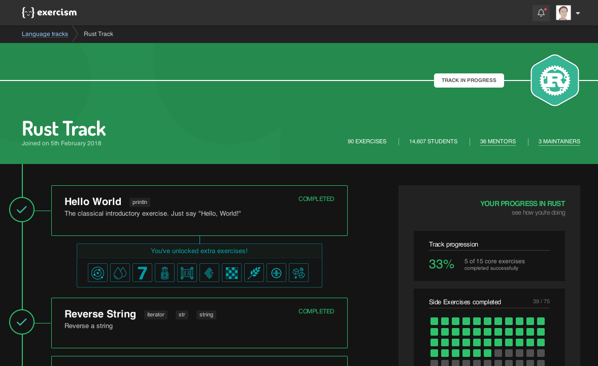

# exercism-dark

A browser theme for [exercism.io](https://exercism.io).

## Installation

You can install this theme on [userstyles.org](https://userstyles.org/styles/174119/exercism-dark).

You need a browser addon for this. I recommend Stylus ([Firefox](https://addons.mozilla.org/de/firefox/addon/styl-us/), [Chrome](https://chrome.google.com/webstore/detail/stylus/clngdbkpkpeebahjckkjfobafhncgmne), [Opera](https://addons.opera.com/de/extensions/details/stylus/)).

After installing the theme, go to _settings_ → _preferences_ and enable the **dark code theme**.

## I'm open for suggestions

Please tell me what features you'd like to have.

## Please report bugs!

Possible bugs include:

- invisible text with the same color as the background
- text, images and icons with too little contrast
- clickable elements that should change color when hovered, but don't
- ugly white lines and areas
- anything that looks ugly, or is inconsistent

## FAQ

### Is Exercism: Teams Edition supported?

No. I might add support in the future, when the Teams Edition is no longer in beta.

### Can I change the colors?

Yes! Follow these steps:

1. Download this repository and edit the colors in [style/variables.scss](style/variables.scss).
2. Compile the file [main.scss](main.scss) using [sass](https://www.npmjs.com/package/sass).
3. Create a new userstyle for `https://exercism.io/` and insert the compiled CSS.

## Contributing

Described [here](CONTRIBUTING.md).

## License
MIT license
